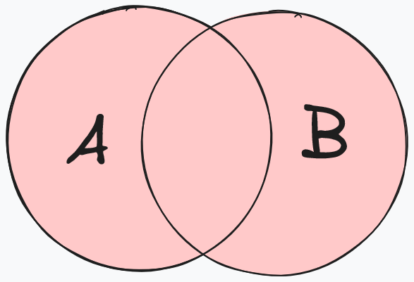
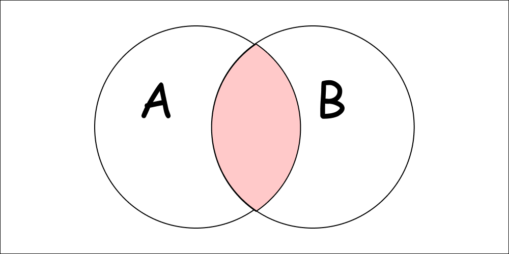
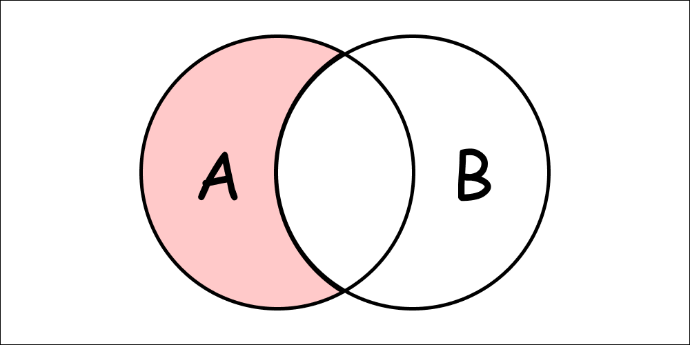

# Methods

## `ICollection[TItem]` implementation

### `func (receiver *Set[T]) Add(item T) interfaces.ICollection[T]`

`Add` adds an element to the set. Overwrites the element if it already exists.

### `func (receiver *Set[T]) AddAll(items interfaces.ICollection[T])`

`AddAll` adds all elements of the given collection to the set. Overwrites the element if it already exists.

### `func (receiver *Set[T]) Clear() interfaces.ICollection[T]`

`Clear` removes the specified item from the set. Returns the set itself.

### `func (receiver *Set[T]) Clone() interfaces.ICollection[T]`

`Clone` returns a new set with the same elements.

### `func (receiver *Set[T]) Count() int`

`Count` returns the number of elements in the set.

### `func (receiver *Set[T]) Default() interfaces.ICollection[T]`

`Default` returns a default empty set.


This method is used internally by the library. You might not need it.


### `func (receiver *Set[T]) Filter(predicateFunc func(T) bool) interfaces.ICollection[T]`

`Filter` removes all elements from the set that do not satisfy the predicate function. Returns the set itself. Original set is not modified.

### `func (receiver *Set[T]) ForEach(appliedFunc func(int, T))`

`ForEach` iterates over the elements of the set. The first argument of the `appliedFunc` is always 0 because sets do not have indexes. The second argument of the `appliedFunc` is the element of the set.

### `func (receiver *Set[T]) Has(item T) bool`

`Has` checks if the set contains the specified item.

### `func (receiver *Set[T]) HasAll(items interfaces.ICollection[T]) bool`

`HasAll` checks if the set contains all the items of the specified collection.

### `func (receiver *Set[T]) HasAny(items interfaces.ICollection[T]) bool`

`HasAny` checks if the set contains any of the items of the specified collection.

### `func (receiver *Set[T]) IsEmpty() bool`

`IsEmpty` checks if the set is empty.

### `func (receiver *Set[T]) ToSlice() []T`

`ToSlice` converts the set to a slice.

## `Set[TItem]` specific methods

### `func (receiver *Set[T]) Union(set *Set[T]) *Set[T]`

<figure><figcaption>
Set Union
</figcaption></figure>

`Union` returns a new set that contains all elements of the set and the specified set. Does not modify the original sets.

### `func (receiver *Set[T]) Intersect(set *Set[T]) *Set[T]`

<figure><figcaption>
Set Intersect
</figcaption></figure>

`Intersect` returns a new set that contains all elements that are in both the set and the specified set. Does not modify the original sets.

### `func (receiver *Set[T]) Difference(set *Set[T]) *Set[T]`

<figure><figcaption>
<code>setA.Difference(setB)</code>
</figcaption></figure>

`Difference` returns a new set that contains all elements that are in the set but not in the specified set. Does not modify the original sets.

### `func (receiver *Set[T]) SymmetricDifference(set *Set[T]) *Set[T]`

<figure><figcaption>
Symmetric Difference
</figcaption></figure>

`SymmetricDifference` returns a new set that contains all elements that are in the set or the specified set, but not in both. Does not modify the original sets.

### `func (receiver *Set[T]) Map(mapper func(int, T) any) *Set[any]`

`Map` applies the given mapper function to each element of the list. Returns a new `Set` containing the results. For better type assertion, use `set.Map`

### `func (receiver *Set[T]) Reduce(reducer func(any, T) any, initialValue any) any`

`Reduce` applies the given reducer function to each element of the list. Returns the accumulated result. For better type assertion, use `set.Reduce`

### `func (receiver *Set[T]) GroupBy(keySelector func(T) any) *hashmap.HashMap[any, *Set[T]]`

`GroupBy` groups the elements of the list by the specified key. Returns a map where the key is the result of the `keySelector` function. For better type assertion, use `set.GroupBy`
